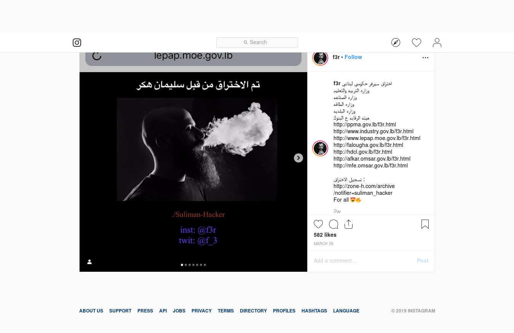
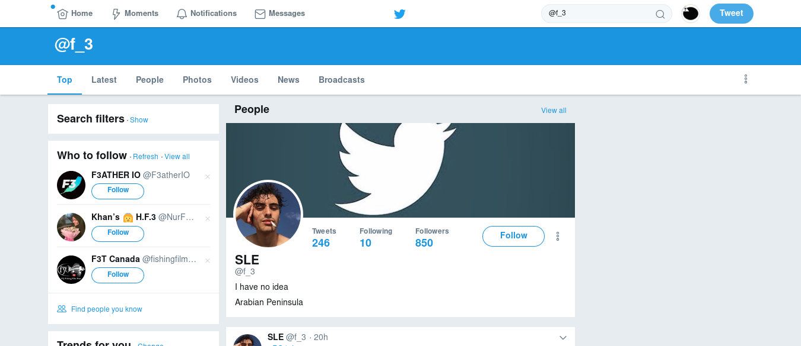

# Defacement by Suliman Hacker

Single HTML file defacement by a Saudi hacker.

## Origin

### IP Address

Not much to say about 5.111.161.142, other than it comes from Saudi Arabia.
That's consistent with the Arabic text in the defacement.

    inetnum:        5.110.0.0 - 5.111.255.255
    netname:        SA-ETTIHADETISALAT
    descr:          Broadband IP Range
    country:        SA
    created:        2012-09-07T13:06:24Z
    last-modified:  2012-09-07T13:06:24Z
    person:         Mobily RIPE Tech
    address:        P.O 69179, Riyadh 11423
    created:        2010-05-09T17:02:15Z
    last-modified:  2017-10-30T22:09:37Z

    route:          5.111.160.0/19
    descr:          Internet Broadband
    origin:         AS34400
    mnt-by:         MOBILY-MNT
    created:        2012-10-17T11:46:30Z
    last-modified:  2012-10-17T11:46:30Z

    route:          5.111.160.0/19
    descr:          Internet Broadband
    origin:         AS35819
    mnt-by:         MOBILY-MNT
    created:        2012-10-17T11:46:03Z
    last-modified:  2012-10-17T11:46:03Z

`p0f3` believes the IP address is run by "Windows NT kernel",
possible via "generic tunnel or VPN".

#### HTTP Accesses

|       Timestamp       | HTTP Response Code | Bytes sent |                   Path part of URI                         |
|-----------------------|--------:|-----------:|-----------------------------------------------------------------:|
| 2019-02-20 15:52:45-07 |     200 |        120 | /wordpress//wp-content/plugins/wp-mobile-detector/cache/db.php|
| 2019-02-20 15:53:55-07 |     200 |        319 | /favicon.ico|
| 2019-02-20 15:53:59-07 |     200 |      13811 | /wordpress//wp-content/plugins/wp-mobile-detector/cache/db.php|
| 2019-02-20 15:54:05-07 |     200 |      21835 | /wordpress//wp-content/plugins/wp-mobile-detector/cache/db.php|
| 2019-02-20 15:54:08-07 |     200 |      13811 | /wordpress//wp-content/plugins/wp-mobile-detector/cache/db.php|
| 2019-02-20 15:54:20-07 |     200 |      13811 | /wordpress//wp-content/plugins/wp-mobile-detector/cache/db.php|
| 2019-02-20 15:54:26-07 |     200 |      21835 | /wordpress//wp-content/plugins/wp-mobile-detector/cache/db.php|
| 2019-02-20 15:54:34-07 |     200 |      21835 | /wordpress//wp-content/plugins/wp-mobile-detector/cache/db.php|
| 2019-02-20 15:54:55-07 |     200 |      21835 | /wordpress//wp-content/plugins/wp-mobile-detector/cache/db.php|
| 2019-02-20 15:55:04-07 |     200 |      21835 | /wordpress//wp-content/plugins/wp-mobile-detector/cache/db.php|
| 2019-02-20 15:55:08-07 |     200 |      13743 | /wordpress//wp-content/plugins/wp-mobile-detector/cache/db.php|
| 2019-02-20 15:55:18-07 |     200 |      13752 | /wordpress//wp-content/plugins/wp-mobile-detector/cache/slo.php|
| 2019-02-20 15:55:22-07 |     200 |      13752 | /wordpress//wp-content/plugins/wp-mobile-detector/cache/slo.php|
| 2019-02-20 15:55:30-07 |     404 |        994 | /wordpress//wp-content/plugins/wp-mobile-detector/cache/f3r.html|

The record I saved is the [2019-02-l20 15:55:04-07](5.111.161.142XG3ayCZP2v-7WKD57Tg1swAAAAI.wso.scans) access.

The accesses of `slo.php` are the only 2 such accesses I have record of.
I kind of wish I'd kept the other records, to find out what Suliman the hacker thought that "slo.php" was. 

The path of the URI is extremely common in my Apache log records,
with 1907 accesses by 335 IP addresses from 2017-12-03 to present.
Most or all of those accesses assume a WSO web shell at the URL.

### Download

Apparently the attacker thought that the URL ending in `/wordpress//wp-content/plugins/wp-mobile-detector/cache/db.php`
was a WSO (Web Shell by oRb) web shell.
An HTTP POST request had the parameters and values typical of a WSO file download.

|Name   | Value |
|:-----:|---------:|
|a|FilesMAn|
|c|/var/www/html/|
|p1|uploadFile|
|charset|Windows-1251|

The HTTP "Accept-language" header had the value "ar,en-US;q=0.9,en;q=0.8"

## Analysis

Everything I can see is consistent with an Arabian hacker trying to "deface"
a website via Web Shell by oRB access he or she has obtained elsewhere,
perhaps by purchasing it.
There's no "hacking" per se, no vulnerabilities exploited, not even a bout of password guess occurred.
Suliman the Haker did everything manually via his or her Chrome browser on Windows (10?).
There might have been a VPN involved.

The actual defacement looks like this:

The Arabic text reads something like "Was Hacked by Suliman Hacker" or "Hacked by Suliman the Hacker".
Inside the [HTML](f3r.html?raw=true) Arabic characters are written in ISO-8859 as numerical character references,
like this: "&amp;#1605;"

The HTML file seems like legit HTML 4.
It even has a "DOCTYPE" header:

    <!DOCTYPE html PUBLIC "-//W3C//DTD HTML 4.01//EN" "http://www.w3.org/TR/html4/strict.dtd">

I'm going to guess that Suliman the Haker wrote this using some kind of HTML editor.
It's one huge line (no line breaks of any sort) of ISO-8859 text.

The "@f3r" instagram user exists, and conveniently has the same defacement picture in
his/her instagram store:

The Twitter user "@f_3" exists, stated name is "SLE".
Seems to be a big fan of first-person-shooter videogames.

